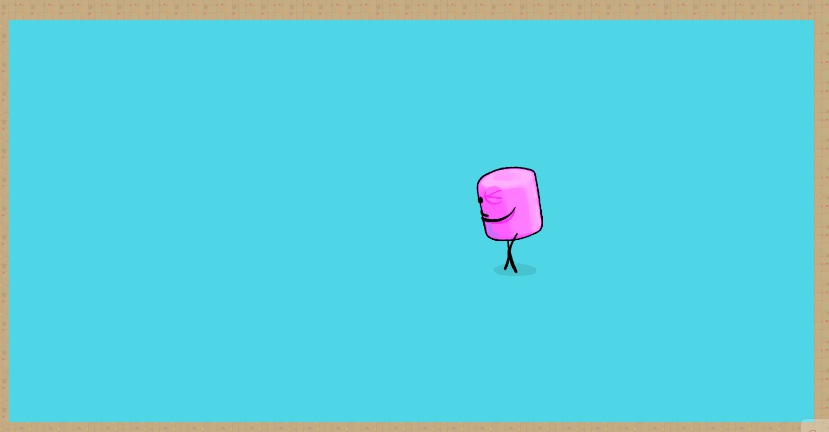

## Físicas

El siguiente Gif muestra el resultado final de la práctica de la parte de físicas:

En la escena PhysicsScene está la siguiente jerarquía:

La primera parte de la práctica corresponde todo lo que está dentro del gameobject Task1. En ella los objetos tienen como componente el script "PhysicsTest", que imprime por pantalla las diferentes tipos de eventos según las físicas del objeto.

La segunda parte de la práctica corresponde a Task2. En ella cada objeto tiene el nombre haciendo referencia a su comportamiento siguiendo la guía de la práctica.

## Sistema de TileMaps

El siguiente Gif muestra el resultado final de la práctica de la parte de tile maps:

La siguiente imagen muestra la ventana tile palette donde están los diferentes tiles usados. Se han usado 2 capas, una para decoración y otra para colisiones y delimitar el mapa.

Aquí se ven la carpeta con el tilepalette y los diferentes tiles.

En la parte de movimiento de personaje, se optó primeramente a usar el transform para mover el personaje, pero como había errores de solapamiento, al final se optó por mover el personaje con el rigidbody, por físicas, usando la IA. El resultado final es que las colisiones son mucho más fieles y no hay solapamientos.