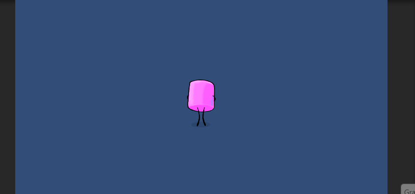

## Actividad Sprites

A continuación se muestra el resultado final de la práctica:

En la siguiente captura se ve como queda el GameObject del personaje después de seguir todos los pasos de la práctica:

En el script "PlayerHorizontalMovement" gestiona el movimiento con el input del jugador. Ya que se está trabajando con Unity 6, se ha optado por utilizar el Input System de Unity. Inicialmente el control de la animación cuando avanza cierta distancia estaba en este script, pero se decidió cambiarlo a otro ya que son comportamientos diferentes e independientes uno de otro.

La carpeta anims donde se encuentran las dos animaciones creadas, una para el movimiento inicial, y otra para caminar:

