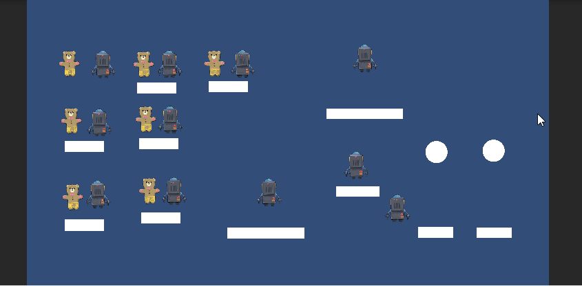

## Físicas

El siguiente Gif muestra el resultado final de la práctica de la parte de físicas:

En la escena PhysicsScene está la siguiente jerarquía:

La primera parte de la práctica corresponde todo lo que está dentro del gameobject Task1. En ella los objetos tienen como componente el script "PhysicsTest", que imprime por pantalla las diferentes tipos de eventos según las físicas del objeto.

La segunda parte de la práctica corresponde a Task2. En ella cada objeto tiene el nombre haciendo referencia a su comportamiento siguiendo la guía de la práctica.

## Sistema de TileMaps
