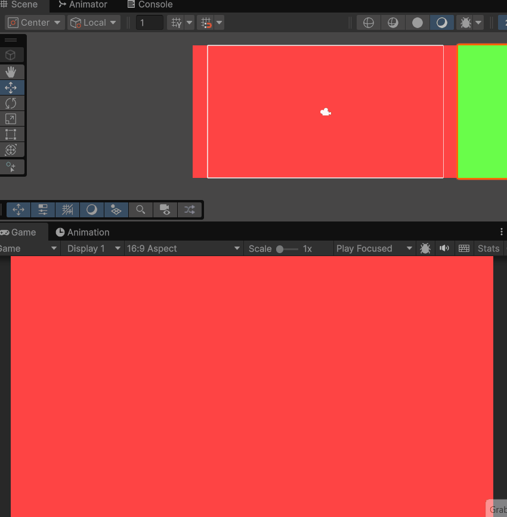
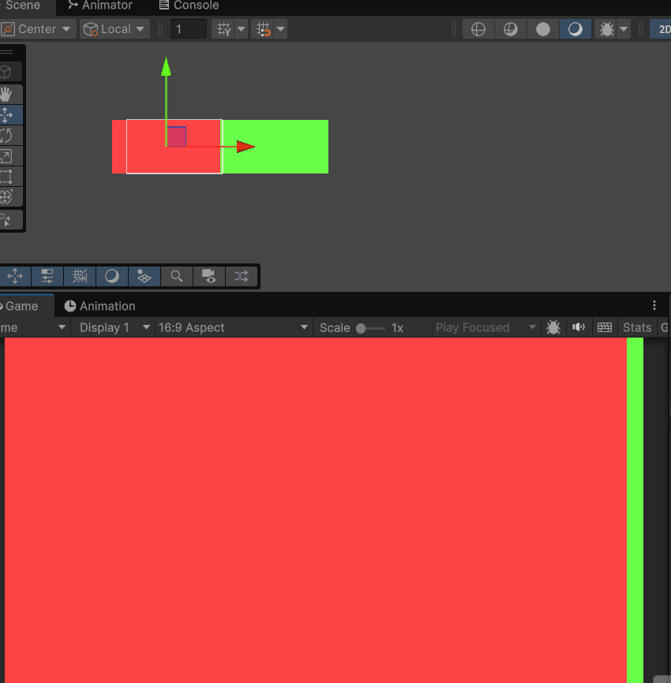
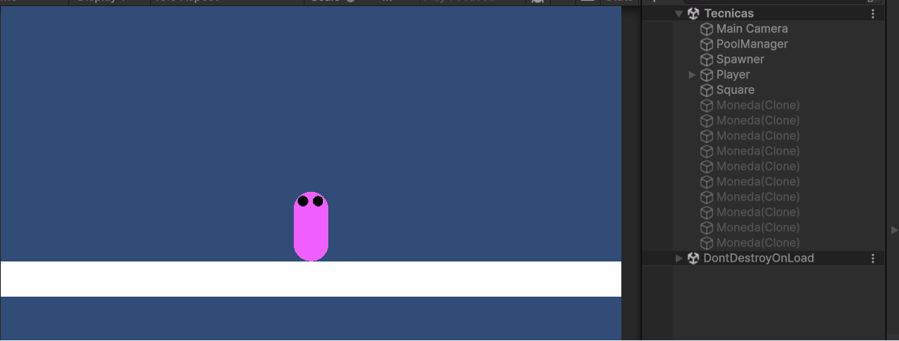

# Tecnicas

## Scroll infinito

## Scroll infinito - camara movimiento

## Scroll textura

## Efecto Parallax - Posicion

## Efecto Parallax - Offset

## Pooling de objetos

## Mejoras rendimiento anterior entrega

En la entrega anterior se pedía una Mecánica de recolección. Se podría optimizar esta entrega teniendo una pool de los objetos que son "recolectables" y así tener un máximo de objetos que pueden aparecer en la escena.

