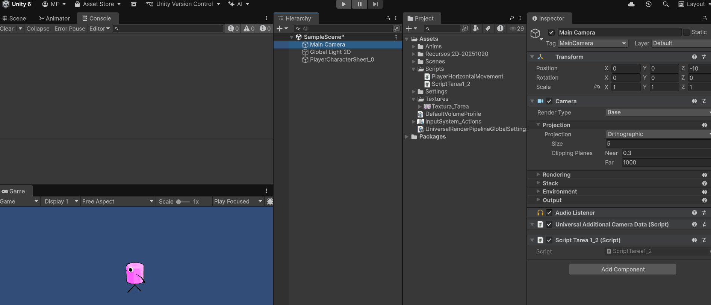

## Gif práctica 1.1
Aquí se muestra el resultado final

## Proceso con capturas
1. Se añaden la textura y se crea el script en el proyecto

.

2. Se muestran los cambios realizados en el repositorio

.

3. Se edita el script con lo que pedía la tarea

.

4. Finalmente se hace Add>commit>Push en ese orden

.
.
